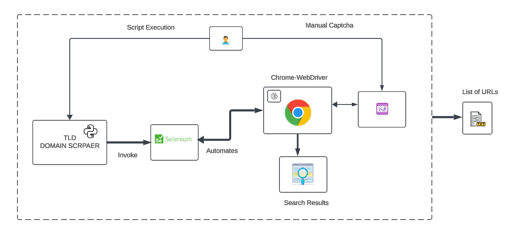

# Python-based Web Scraper for Tracking Domains by TLD (TLD-Domain-Scraper)

A Python-based web scraper using Selenium to gather domain names across multiple Top-Level Domains (TLDs) from search engine results.

## Overview
The idea is to build a Python-based web scraper using Selenium to collect and maintain a list of domain names across multiple Top-Level Domains (TLDs), and country-specific TLDs for example .uk, .fr, .ru, etc. These domain lists can then be used for scraping relevant websites that report or publish information on political changes, events, or disease outbreaks.



### Application Areas
By targeting specific TLDs and excluding certain government websites (to avoid regulatory or policy conflicts), this tool can build a comprehensive dataset of news websites, blogs, government portals, and NGOs that are likely to provide real-time information on rapidly changing events.

**Application Areas:**

- **Monitoring Political Changes:**
  Elections, protests, policy changes, or international relations often generate a significant amount of online discussion, with articles, reports, and press releases published across many different TLDs.

- **Tracking Events or Natural Disasters:**
  Natural disasters, including earthquakes, floods, and hurricanes, often lead to a spike in online reporting. Local news websites, emergency portals, and community blogs may provide early warnings, first-hand accounts, or official updates. Scraping domains in regions frequently affected by natural disasters (e.g., .au for Australia, .jp for Japan) can enable automated monitoring of related information.

- **Following Disease Outbreaks:**
  Epidemics and pandemics, such as the recent COVID-19 outbreak, produce immense amounts of information from government health agencies, international organizations (e.g., WHO), research institutions, and news outlets. Additionally, different countries may have official health portals.

- **Detect Cyber Threats:**
  Identify which domains correlate with cyber threats and bad actors.

- **Academic Research**

### Plan
1. Create a list of domain names across various Top-Level Domains (TLDs) by using the Python-based web scraper.
2. Process those websites and extract meaningful information: This involves scraping individual pages, organizing the collected data, and preparing it for analysis or indexing into a search engine or analytics platform.
3. Store the scraped content in a structured format.
4. Preprocess the data by cleaning the text if needed.
5. Perform language detection and translation to English.
6. Run text analysis techniques, such as Named Entity Recognition (NER) and sentiment analysis techniques.
7. Index the cleaned and processed data into a search engine (e.g., Elasticsearch) or import it into an analytics platform to enable real-time querying and trend analysis.
8. Monitor the data over time to detect emerging patterns or trends.
9. Visualize the results.

---

## Dependencies

### **For Fedora/RHEL/Rocky Linux:**
```bash
dnf install python3 python3-devel chromedriver chromium-browser -y
```

### **For Ubuntu:**
```bash
sudo apt update && sudo apt upgrade -y
sudo apt install python3 python3-venv python3-dev chromium-driver chromium-browser -y
```

### **For macOS M1/M2:**
1. **Install Homebrew:**
   ```bash
   /bin/bash -c "$(curl -fsSL https://raw.githubusercontent.com/Homebrew/install/HEAD/install.sh)"
   ```

2. **Install Python, Chromium, and ChromeDriver:**
   ```bash
   brew install python@3.9
   brew install chromium chromedriver
   ```

3. **Add ChromeDriver to PATH:**
   ```bash
   export PATH="/opt/homebrew/bin:$PATH"
   ```

4. **Verify Installation:**
   Ensure that both `chromium` and `chromedriver` are installed correctly:
   ```bash
   chromium --version
   chromedriver --version
   ```

5. **Create a Python Virtual Environment and Activate it:**
   ```bash
   python3 -m venv venv
   source venv/bin/activate
   ```

6. **Install Required Libraries:**
   ```bash
   pip install selenium requests
   ```

---

## Clone the Repository
```bash
git clone https://github.com/allamiro/TLD-Domain-Scraper.git
cd TLD-Domain-Scraper
```

---

## Update Code for Specific TLDs

Update these portions of the code to reflect the target TLDs, government site exclusions, and the country name you're querying. A complete list of TLDs for each country can be found at [Whois Data Center](https://whoisdatacenter.com/country/).

1. **Edit `tld-domains-scraper.py`:**

```python
# List of TLDs to search
tlds = [
    ".IR",
    ".PERSIANBLOG.IR",
    ".RZB.IR",
    ".CO.IR",
    ".AC.IR",
    ".SCH.IR",
    ".ORG.IR",
    ".ID.IR",
    ".R98.IR",
    ".EPAGE.IR"
]

# Base query excluding .gov.ir domains
base_query = "-site:.gov.ir"

if href and tld.lower() in href.lower() and '.gov.ir' not in href and 'translate.google.com' not in href:
```

2. **Update Output File Naming Convention:**
```python
filename = f"iran_{tld_clean}.txt"
```

---

## Disclaimer

This project is provided for **educational purposes only**. The creators and contributors of this project are not responsible for any misuse or illegal activities performed with this code.

The script involves manual CAPTCHA solving and doesn’t use automated CAPTCHA-solving services or tools. As long as a human (you) is solving the CAPTCHA, it may be considered compliant with the spirit of CAPTCHA usage. However, repeated automation requests or violating website terms of service may result in consequences like IP bans.

### Responsibilities of the User:
- Ensure that your use of this tool complies with relevant laws, regulations, and website terms of service.
- This tool is provided "as is," without warranties of any kind.
- Use at your own risk.

---

### No Warranty
This tool is provided **without any warranties**, express or implied, including but not limited to the implied warranties of merchantability, fitness for a particular purpose, or non-infringement.

### Use at Your Own Risk
By using this tool, you agree to use it at your own risk. The developers assume no liability for any legal or financial consequences resulting from the misuse or abuse of this tool.
