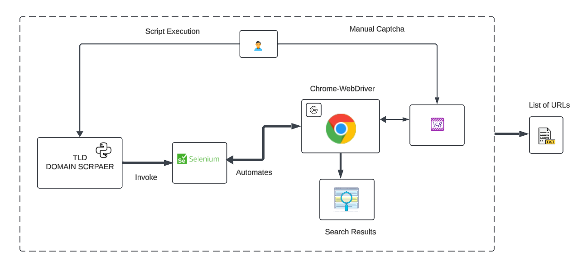

# Python-based Web Scraper for Tracking Domains by TLD (TLD-Domain-Scraper)

A Python-based web scraper using Selenium to gather domain names across multiple Top-Level Domains (TLDs) from search engine results.

## Overview
The idea is to build a Python-based web scraper using Selenium to collect and maintain a list of domain names across multiple Top-Level Domains (TLDs), and country-specific TLDs for example .uk, .fr, .ru, etc. These domain lists can then be used for scraping relevant websites that report or publish information on political changes, events, or disease outbreaks.



### Application Areas
By targeting specific TLDs and excluding certain government websites (to avoid regulatory or policy conflicts), this tool can build a comprehensive dataset of news websites, blogs, government portals, and NGOs that are likely to provide real-time information on rapidly changing events.

**Application Areas:**

- **Monitoring Political Changes:**
  Elections, protests, policy changes, or international relations often generate a significant amount of online discussion, with articles, reports, and press releases published across many different TLDs.

- **Tracking Events or Natural Disasters:**
  Natural disasters, including earthquakes, floods, and hurricanes, often lead to a spike in online reporting. Local news websites, emergency portals, and community blogs may provide early warnings, first-hand accounts, or official updates.

- **Following Disease Outbreaks:**
  Epidemics and pandemics produce immense amounts of information from government health agencies, international organizations (e.g., WHO), research institutions, and news outlets.

- **Detect Cyber Threats:**
  Identify which domains correlate with cyber threats and bad actors.

- **Academic Research**
  * Computational Social Science, Linguistic Analysis, Network Analysis, Crisis Informatics, Cybersecurity Research, Public Health Surveillance, Policy and Governance Studies.

### Plan
1. Create a list of domain names across various TLDs using the Python-based web scraper.
2. Process those websites and extract meaningful information.
3. Store the scraped content in a structured format.
4. Preprocess and clean text data.
5. Perform language detection and translation to English.
6. Run NER and sentiment analysis.
7. Index the processed data into a search engine or analytics platform.
8. Monitor data over time to detect emerging patterns.
9. Visualize the results.

---

## What's New (Recent Improvements)

### CLI Scraper (`tld-domains-scraper.py`)

| Area | Before | After |
|---|---|---|
| TLD matching | `tld.lower() in href.lower()` — false positives (`.ir` matches `.ireland`) | Hostname-exact suffix check using `urlparse` |
| Driver lifecycle | No cleanup on error | `try/finally` always calls `driver.quit()` |
| Driver config | Visible browser window | Headless Chrome with anti-detection UA |
| Output location | Saved to wherever the script runs | `output/` subdirectory next to the script |
| Filenames | `.PERSIANBLOG.IR` → `persianblogir.txt` | Structured: `iran_persianblog_ir.txt` |
| Logging | `print()` calls scattered throughout | `logging` module with timestamps |
| Summary | Per-TLD files only | Combined `output/all_domains.txt` (url + tld columns) |
| Error handling | Unhandled exceptions left browser open | `WebDriverException` caught and logged |

### Web App (`tld-domain-scraper-webapp/`)

| Area | Before | After |
|---|---|---|
| **Critical bug** | `tld=tld` in DB loop — all rows labelled with the *last* TLD | Each domain correctly tagged with its own TLD |
| Download route | Stub (`pass`) — returned nothing | Full CSV export with optional TLD filter |
| Chrome in Docker | `webdriver.Chrome()` — no headless flags, fails without a display | Headless with `--no-sandbox`, `--disable-dev-shm-usage` |
| DB URI | Hardcoded `postgresql://user:password@db:5432/domains` | Read from `DATABASE_URL` env var; falls back to SQLite for local dev |
| Blueprint wiring | `register_blueprint` in `run.py` only | Registered inside `create_app()` so the factory is self-contained |
| `tld` column length | `String(10)` — too short for `.PERSIANBLOG.IR` | `String(64)` |
| Duplicate domains | No constraint — same URL inserted multiple times | `UniqueConstraint("url", "tld")` + skip-on-duplicate logic in scraper |
| Deprecated `datetime.utcnow()` | `datetime.utcnow()` (Python 3.12 deprecated) | `datetime.now(timezone.utc)` |
| Results page | No search, no filter, no pagination, no empty state | URL search + TLD dropdown filter + server-side pagination (50/page) + empty state message |
| Bootstrap 5 `.jumbotron` | Used removed class — rendered unstyled | Replaced with custom `.hero-banner` using CSS gradient |
| Flash messages | No flash messages in templates | `layout.html` renders dismissible Bootstrap alerts |
| JS scrape button | Text changed but no spinner | Spinner shown + button disabled on submit |
| `docker-compose.yml` | Deprecated `version:` field; `latest` Postgres image; no healthcheck; webapp could start before DB was ready | Removed `version:`; pinned `postgres:16-alpine`; `healthcheck` + `depends_on: condition: service_healthy` |

---

## Dependencies

### **For Fedora/RHEL/CentOS/Rocky Linux:**
```bash
dnf install python3 python3-devel chromedriver chromium-browser -y
```

### **For Ubuntu:**
```bash
sudo apt update && sudo apt upgrade -y
sudo apt install python3 python3-venv python3-dev chromium-driver chromium-browser -y
```

### **For macOS M1/M2:**
> When running on macOS, allow Chromium and chromedriver to run via System Settings → Security.

1. **Install Homebrew:**
   ```bash
   /bin/bash -c "$(curl -fsSL https://raw.githubusercontent.com/Homebrew/install/HEAD/install.sh)"
   ```

2. **Install Python, Chromium, and ChromeDriver:**
   ```bash
   brew install python@3.12
   brew install chromium chromedriver
   ```

3. **Create and activate a virtual environment:**
   ```bash
   python3 -m venv venv
   source venv/bin/activate
   ```

4. **Install required libraries:**
   ```bash
   pip install selenium
   ```

---

## Running the CLI Scraper

```bash
# Clone the repo
git clone https://github.com/allamiro/TLD-Domain-Scraper.git
cd TLD-Domain-Scraper

# Set up virtualenv (optional but recommended)
python3 -m venv venv && source venv/bin/activate
pip install selenium

# Run the scraper
python tld-domains-scraper.py
```

Output files are written to `output/`:
- `iran_<tld>.txt` — one file per TLD, one base domain per line
- `all_domains.txt` — combined file with `url<TAB>tld` columns

To target different TLDs, edit the `tlds` list at the top of `tld-domains-scraper.py`.

---

## Running the Web App

### With Docker Compose (recommended)

```bash
cd tld-domain-scraper-webapp
docker compose up --build
```

Then open [http://localhost:5000](http://localhost:5000).

> The webapp waits for PostgreSQL to pass its healthcheck before starting, so there is no need to add manual sleep delays.

### Without Docker (local dev with SQLite)

```bash
cd tld-domain-scraper-webapp
python3 -m venv venv && source venv/bin/activate
pip install -r requirements.txt
python run.py
```

SQLite is used automatically when `DATABASE_URL` is not set.

### Environment Variables

| Variable | Default | Description |
|---|---|---|
| `DATABASE_URL` | `sqlite:///domains.db` | SQLAlchemy-compatible DB URI |
| `SECRET_KEY` | `dev-secret-change-me` | Flask secret key — **change in production** |

---

## Customising Target TLDs

Edit the `tlds` list in `tld-domains-scraper.py` (CLI) or submit them through the web form. A complete list of country-code TLDs is available at [Whois Data Center](https://whoisdatacenter.com/country/).

---

## Disclaimer

This project is provided for **educational purposes only**. The creators and contributors are not responsible for any misuse or illegal activities performed with this code.

The script includes manual CAPTCHA handling and does not use automated CAPTCHA-solving services. Repeated automation requests or violating a website's terms of service may result in IP bans.

**Responsibilities of the User:**
- Ensure compliance with relevant laws, regulations, and website terms of service.
- This tool is provided "as is," without warranties of any kind.
- Use at your own risk.

### No Warranty
This tool is provided **without any warranties**, express or implied, including but not limited to the implied warranties of merchantability, fitness for a particular purpose, or non-infringement.
